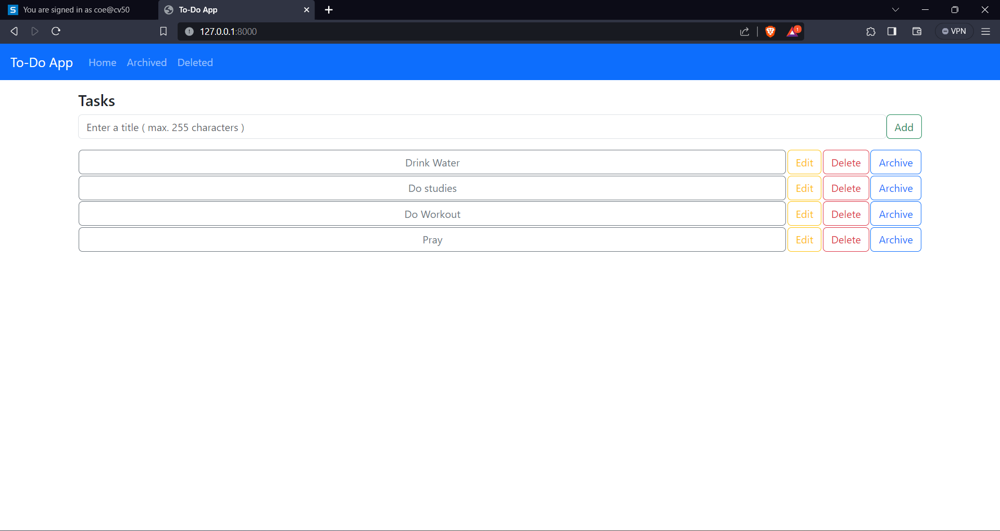
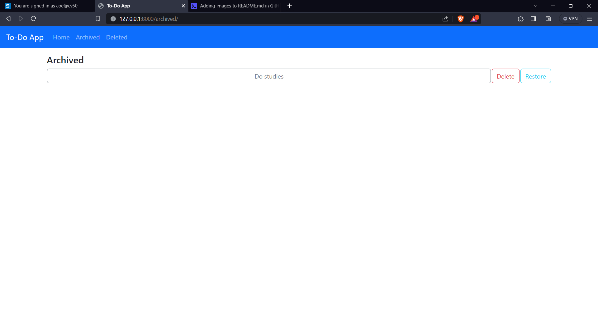
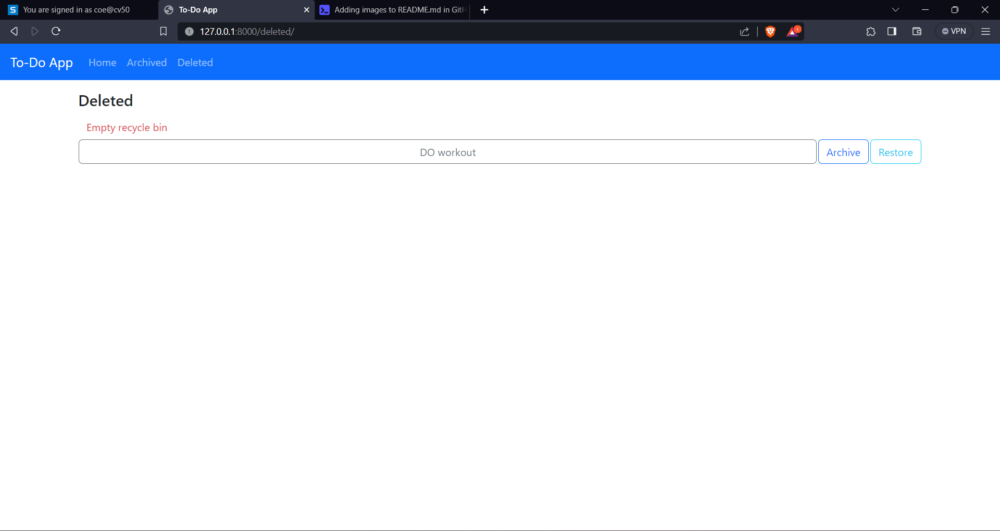

Move into the directory: 
```
cd django-to-do-app
```


Creating, activating a virtual environment and installing dependencies:
```
py -m venv env
.\env\Scripts\activate
pip install -r requirements.txt
```


To run the application:
```
py manage.py runserver
```

Open your web browser and go to the address: http://127.0.0.1:8000/

ScreenShots:

Homescreen(task adding and display):


Archieved(Display archieved tasks):


Deleted(Display Deleted Tasks):



